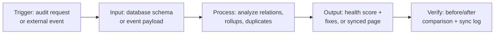

# Proposal: Notion Specialist & Systems Architect for High-Growth Company

## 1. Demo Link

**Live demo:** https://notion-workspace-auditor-demo.streamlit.app/
**Repo:** https://github.com/PureGit90/notion-workspace-auditor-demo

Built a working Notion workspace auditor so you can see exactly how I'd approach your system before we talk.

## 2. Hook

You said your growth team relies on Notion for operations, project tracking, and documentation, and you need someone to audit the structure, build proper relations/rollups/formulas, and keep it clean as you scale. I built a tool that does the audit part live: point it at a workspace and it flags missing relations, duplicate status options, missing rollups, and unused formula opportunities, then scores the workspace and lists concrete fixes.

## 3. Demo Reference

- Enter a database name and run the audit: health score out of 100, a table of specific issues, a list of fixes
- Second section simulates the n8n/Zapier/Make side: submit a mock external event and watch it land as a properly structured Notion page in real time
- Runs on realistic sample data out of the box, or connect a Notion API key for a live scan of an actual workspace
- Screenshot attached

## 4. Architecture Breakdown

**Trigger:** Manual audit request, or an external tool event (form, CRM update) hitting a sync endpoint
**Input:** Notion database schema (via API) or the incoming event payload
**Processing:** Schema analysis (relations, rollups, duplicate options, orphaned properties) or payload mapping into the right Notion properties
**Output:** Audit report with a health score and prioritized fixes, or a newly created/updated Notion page
**Verification:** Before/after schema comparison, and a sync confirmation log for every automated write

## 5. Tech Stack & Timeline

**Stack:** Notion API, Python, n8n/Make for the external sync layer
**Timeline:** I'd start with a working session against your actual workspace in the first week, then build out the database relations, rollups, dashboards, and sync integrations over the following 2-3 weeks depending on scope
**What you get:**
- A workspace that's actually trusted, with relations and rollups doing the work instead of manual tracking
- Documented structure so the team isn't guessing at how it's wired
- The n8n/Make sync layer connecting whatever external tools you need

## 6. Pricing

**$42/hr**, within your posted range. Given the scope (audit, rebuild, dashboards, external integrations, ongoing maintenance), this fits best as an hourly engagement rather than a single fixed quote. I'd suggest starting with a paid 3-4 hour audit block to map the real state of your workspace and scope the rebuild precisely, before committing to the full build.

Free Tuesday or Wednesday for a 15-minute call to look at your actual workspace. Which works better for you?
