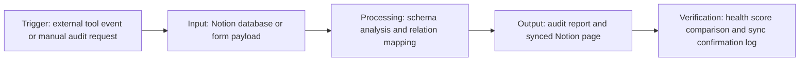

# Workflow

```mermaid
graph LR
    A[Trigger: external tool event or manual audit request] --> B[Input: Notion database or form payload]
    B --> C[Processing: schema analysis and relation mapping]
    C --> D[Output: audit report and synced Notion page]
    D --> E[Verification: health score comparison and sync confirmation log]
```
